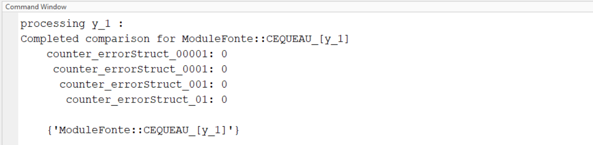

# Purpose

This guide provides instructions for setting up the development
environment for Cequeau.

# Folder Structure

```
cequeau/
├── src/
├── tests/
├── docs/
└── mex/
```

The `src/` folder contains all header and source files for the C++ mex
function, and also the matlab and octave compilation files.

The `tests/` folder contains various folders to test functions and
features.

The `docs/` folder contains documentation for the development and usage of
Cequeau

The `mex/` the compiled mex binaries will be placed within this folder

# Software Requirements

The following section outlines the software and tools necessary to
develop and compile Cequeau. Cequeau can be compiled using both Matlab
and Octave.

## C++ Compiler

A C++ compiler that supports **at least C++14**.

### Matlab


Matlab supports both GCC (MinGW) and MSVC,
with different supported compiler versions for each release. The
supported compilers can be found
[**here**](https://www.mathworks.com/support/requirements/previous-releases.html),
within the compilers section.

#### MSVC (Microsoft Visual C++)

MSVC is installed by installing Visual Studio with the "**Desktop
development with C++**" option enabled. The required Microsoft Visual
Studio version will depend on the Matlab version and its supported
compilers. For example, when using Matlab R2020b, which supports up to
Microsoft Visual C++ 2019, it requires Visual Studio 2019.

#### GCC (MinGW)

MinGW-w64 is a GCC toolchain for the Windows platform. It can be
installed by following [Mathwork\'s
guide](https://www.mathworks.com/matlabcentral/fileexchange/52848-matlab-support-for-mingw-w64-c-c-fortran-compiler).

### Octave

Cequeau v5.0.0 was developed using Octave 9.4, and MinGW 13. A newer
version of octave and compiler will also satisfy the requirements and
compile the code.

The latest version of MinGW-w64 can be installed through MSYS2.

# Compilation

### Compilation in Matlab

The Matlab script to compile the C++ mex function is
`cequeau/src/compileCequeauMat.m`.

All relevant `.cpp` source files are appended to the `SOURCES` argument, if
a new file is to be added, it should be appended in a similar manner.

To ensure consistency, the C++ version is specified within the compile
arguments. As shown below, the script automatically detects the compiler
and sets the flags accordingly. `COMPFLAGS` is used for MSVC and `CXXFLAGS`
is used for GNU. More information about `mex` and the compiler flags can
be found here (<https://www.mathworks.com/help/matlab/ref/mex.html>).

To enable logging to the `.log` file, set the `log` variable to `true`.


To enable debugging, the `-g` flag must be set, to do so, simply set the
`debug` variable to `true`.


The output file is specified in the `OUTFILE` variable, by default the
compiled mex will be placed in `cequeau/mex/`.


### Compilation in Octave

The compilation for octave is similar to the compilation in Matlab, with
only some syntactical differences. As shown below
(`cequeau/src/compileCequeauOct.m`).


The `FLAGS` variable contains the custom flag `-DENV_OCTAVE`, which is
used within the cequeau program to detect whether it is the octave
version being run. This allows the ability to customize certain elements
depending on the environment. For example, it is used to append `Oct` or
`Mat` at the end of the log file to help the user identify the appropriate
log file.

### Compilation of Cequeau Interpolation

The interpolation compilation scripts (`compileInterpolationMat.m` and
`compileInterpolationOct.m`) are both similar to their respective Cequeau
Quantite compilation scripts, except they are targeting the source files
relevant for `InterpolationMex.cpp`.

# Usage

Compiling the C++ code using Matlab or Octave mex creates a mex file
(`.mexw64` or `.mex`). This file is used as a Matlab/Octave function. It
takes in various inputs and the order matters, therefore if an input is
optional, it is still required to provide an empty array `[]` within the
input list. For detailed explanation about all of the inputs and
outputs, please refer to `'Intrants -- Extrants v5.docx'` and for a more
in depth usage guide, follow `'Cequeau_Guide.docx'`.

Here is an example usage:

```matlab
[y.etatsCE, y.etatsCP, y.etatsFonte, y.etatsEvapo, y.etatsBarrage, ...
 y.pasDeTemps, y.avantAssimilationsCE, y.avantAssimilationsFonte, ...
 y.avantAssimilationsEvapo, y.etatsQualCP, y.avAssimQual] = ...
    cequeauQuantiteMat(struct.execution, struct.parametres, ...
                       struct.bassinVersant, struct.meteo, ...
                       struct.etatsPrecedents, struct.assimilations, ...
                       struct.stations);
```

After running this function, all of the outputs will be placed in the
variables provided in the left side of the function.

# Logging to .log file

A custom logger (`log.h`) was written to log data to a `.log` file during
testing. This feature is useful for quick testing and ensuring expected
functionality. It has various logging levels that can be used to print
out the desired type of information.

```cpp
enum TLogLevel {logERROR, logWARNING, logINFO, logDEBUG, logDEBUG1,
               logDEBUG2, logDEBUG3, logDEBUG4};
```

The logLevel is specified within the `cequeauQuantiteMex.cpp` file:

```cpp
FILELog::ReportingLevel() = logINFO; // or logWarning, logError, logDebug, etc...
```

# Debugging

The most convenient way to debug a mex program is using Visual Studio,
by attaching the process to the running matlab instance.

1.  Compile the Mex function with debug enabled

    > Within the appropriate script to compile, set `debug` to `true`. After
    > compilation, there should be a `.pdb` file alongside the `.mex` file.

2.  
    Open visual studio and continue without code

3.  
    Click the `Attach to Process...` button in the top
    toolbar (The exact icon/location might vary slightly)

4.  Find and attach to the Matlab process (e.g., `MATLAB.exe`). You can use the filtering
    textbox for quick retrieval.

    

5.  
    Open the source file `cequeauQuantiteMex.cpp`. Go to `File -> Open -> File`, and locate the file that was compiled in the Matlab workspace.

6.  Set a breakpoint at the entry point, `mexFunction()`. Right click on
    the line, `Breakpoint -> Insert Breakpoint`.

7.  Now go back to matlab, and run the function.

8.  Visual Studio should display the function blocked at the breakpoint.

9.  
    Disable `Access Violation` exceptions if they interrupt debugging unnecessarily. (Go to `Debug -> Windows -> Exception Settings` and uncheck `Common Language Runtime Exceptions -> System.AccessViolationException` or similar, depending on VS version).

10. The program can now be debugged like any other C++ program, using
    `Step Into` (F11), `Step Over` (F10), `Continue` (F5), etc.

# Testing Matlab and Octave

Cequeau v5.0.0 added support for Octave. To validate the octave compiled
version, test run files were created to ensure the Octave version
produced the same output as the Matlab version. The Matlab and Octave
versions are tested with the same inputs, and the outputs are compared
to ensure there are no differences.

The comparison testing is within `Cequeau/tests/testing_octave/`

The `testing_octave/scripts/` folder contains Matlab and Octave scripts to
run the program with various configurations. For example,
`run_mat_fonte_0_Cequeau.m` tests the program with the Cequeau melting
module in Matlab. The `run_oct_fonte_0_Cequeau.m` is the octave
equivalent. Each of these files saves an output variable that is saved
as `.mat` files within the `testing_octave/outputs/` folder. The following
image demonstrates an example. The outputs are saved as v7 mat files
since that is the highest version supported by Octave.



Within the `testing_octave/` folder, the