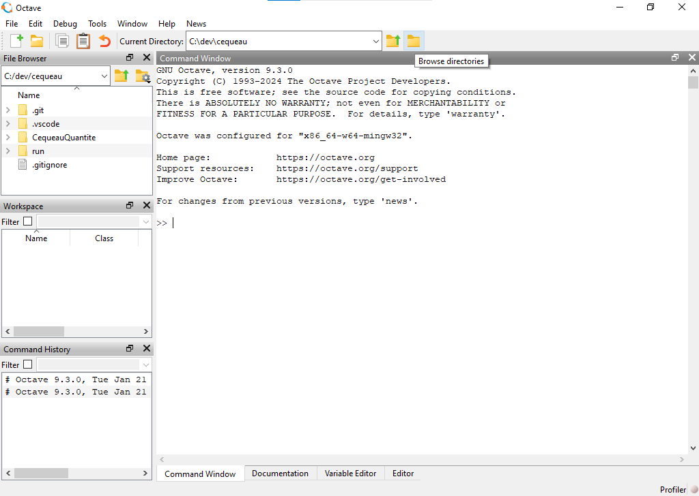

## Octave Installations

The latest version of Octave can be downloaded from:
<https://octave.org/download>

The link to download specific versions is at the bottom of the page
(<https://mirror2.evolution-host.com/gnu/octave/windows/>)

Cequeau was tested with version 9.1.0 and it should work with newer
versions.

## Launching and Using Octave GUI

Launch GNU Octave GUI to launch the graphical user interface
application. As shown below, it is similar to Matlab. To run files, you
need to navigate to the appropriate directory.



The Cequeau Mex program needs to be compiled using Octave for it to be
used as a program using Octave. `Cequeau/src/` contains all of the source
files as well as the compilation files for both Matlab
(`compileCequeauMat.m`) and Octave (`compileCequeauOct.m`).


The command statement using `mkoctfile` is the line used to compile the
octave mex program. The path `"../mex/cequeauQuantiteOct"` path indicates
where to place the mex program and what to name it (`cequeauQuantiteOct`).
Running the file using the green run button at the top will place
`cequeauQuantiteOct.mex` in the `mex` directory within Cequeau/. This file
is portable and can be placed wherever the program needs to be run.

## Octave and Matlab Compatibility

Octave syntax is mostly compatible with Matlab, therefore the files can
be used with both languages. However, the cequeau program (Octave .mex
or Matlab .mexw64) needs to be called from the appropriate program.

There are some features that are not fully compatible or need an Octave
workaround.

### .mat files

As of version 9.3.0, Octave does not support saving in Matlab's v7.3
binary format. If files may be used by both Matlab and Octave, it is
recommended to save them as v7 using `--v7` argument.

```matlab
save('myfile.mat', 'myfile', '-v7')
```

### datetime

Octave does not support Matlab's `datetime`, therefore it is recommended
to use `datenum` instead.

In Octave, to view a date in string format, the `datestr()` function can
be used.

When plotting, simply use `datenum`, and use `datetick` function as shown
below:

```matlab
figure;
hold on;

% Plotting without pumping
plot(dates.sim, yNiveauEauNappe(2:end), 'b-', 'LineWidth', 1.5); % Blue line

% Plotting with pumping avec recharge and based on area of influence
plot(dates.sim, ypAvecR_aire_NiveauEauNappe(2:end), 'k:', 'LineWidth', 1.5);

% Add labels and title
xlabel('Date');
ylabel('NiveauEauNappe');
title('NiveauEauNappe idCE 51');
legend('Without Pumping', 'With Pumping area influence (avec R)');

% Improve date formatting on x-axis
datetick('x', 'yyyy-mm-dd', 'keepticks'); % use datetick
grid on;
hold off;
```

<!-- Note: The image above (image3.emf) is in EMF format, which may not render correctly in all Markdown viewers or web browsers. Consider converting it to PNG or JPG if possible. -->

For a complete overview of all timing functions:
<https://wiki.octave.org/Date/Time_functions>
